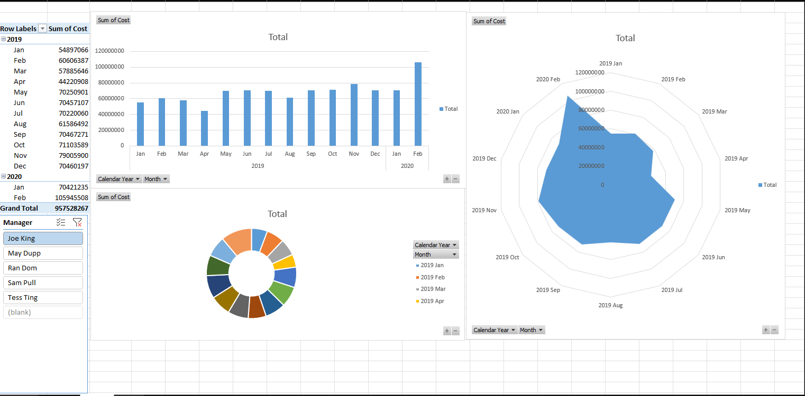

📊 Excel Pivot Analysis – 10 Million Rows Project

This project demonstrates how to use Excel with Power Query and Pivot Tables to analyze a dataset with over 10 million rows using a dynamic folder connection.

🚀 Objective

The goal of this project is to showcase that Excel, when optimized with Power Query and structured folder sources, is capable of processing and summarizing massive datasets efficiently — without the need for external databases.

🧰 Tools Used

Microsoft Excel 365

Power Query

Pivot Table

Folder data connection

Slicers and timeline filters

📁 File Structure

10millionrows.xlsx

PowerQuery

Mapping

Data model mapping and reference guide

Sheet1

Placeholder sheet / test sheet

Images

Contains inserted preview images (dashboard)

Hidden Pivot

Core Pivot Table calculation (linked to slicers)

Hidden Data

Processed Power Query output

📈 Key Features

Connected to a folder with multiple large CSV files

Data imported and refreshed via Power Query

Pivot Table enables dynamic slicing by dimensions

Clean and minimal interface for presentation

📸 Preview

🔄 Refresh Instructions

In Excel: go to Data > Refresh All to update the PivotTable from the source folder.

💡 Use Case Examples

Aggregating transactions or events over time

Handling logs or records too large for standard Excel sheets

Building dashboards without learning new BI tools

📎 How to Explore

Open the .xlsx file

Go to the Hidden Pivot sheet

Use slicers (if visible) or unhide filters to explore data

Optionally: inspect Power Query in Data > Queries & Connections
